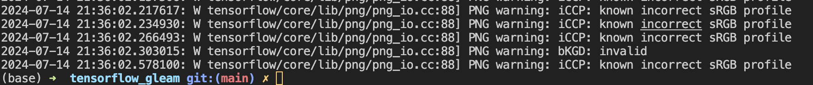

# Tensorflow Gleam & Pokémon.

This is a little repo that demonstrates how we can use Tensorflow JS in gleam to train little model.

## Requirements

We will need npm

## Datasets 

We can use a large amount of dataset, in our case, we use : 
https://www.kaggle.com/datasets/mikoajkolman/pokemon-images-first-generation17000-files/data
and then, we just put it into data/pokemon

## How to run a training ?
```sh
gleam run
```

## For the future

- Improve this model and make it really efficier, actually it just learn like an idiot and don't answer well
- Make the tensorflow gleam lib better and more concise
- Add save for the model at the end of the training
- Add catch for incorrect sRGB profile and "invalid"

